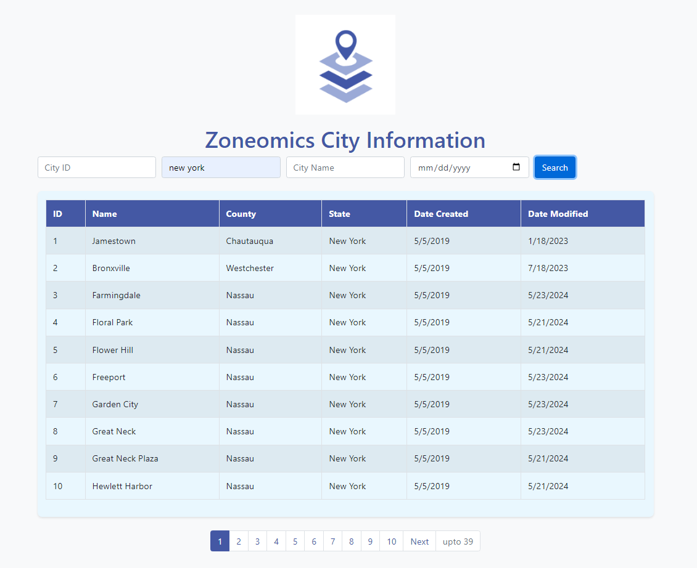

# City API Visualization

This project provides a web interface for visualizing city information from an API. Users can search for cities based on various filters and view the results in a tabular format.





## Features

- Search cities by:
  - City ID
  - State Name
  - City Name
  - Modified Date
- Pagination for navigating through results
- Responsive design using Bootstrap

## Technologies Used

- HTML
- CSS
- JavaScript (jQuery)
- Bootstrap

## Installation

1. Clone the repository:
   ```bash
   git clone <repository-url>
